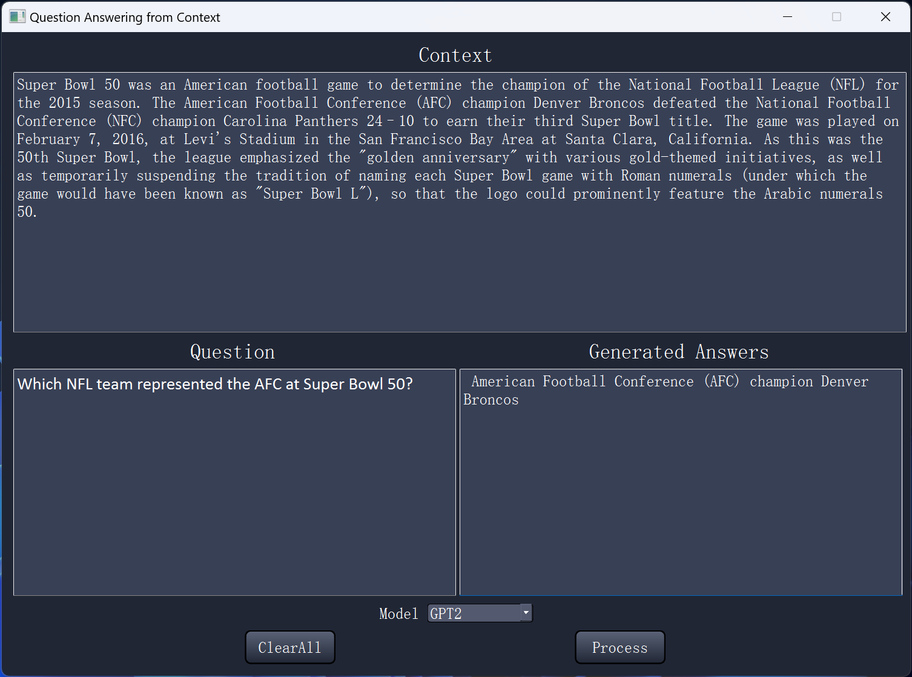

# Q%A from context using GPT finetuning with LoRA

This project aims to preform Question and Answering from Context using Decoder only Transformer (GPT2) pretrained weights loaded from huggingface finetune on Stanford QA dataset with LoRA.




### Dataset: 
[Kaggle sports classification](https://www.kaggle.com/datasets/rtatman/questionanswer-dataset/data)


### Pretrained Model Weights:
[GPT2 huggingface pretained weights](https://huggingface.co/openai-community/gpt2)


### Build: 

	CPU: Intel i9-13900H (14 cores)
	GPU: NVIDIA RTX 4060 (VRAM 8 GB)
	RAM: 32 GB


### Python Packages:

	conda install pytorch==2.1.2 torchvision==0.16.2 torchaudio==2.1.2 pytorch-cuda=12.1 -c pytorch -c nvidia
	conda install -c conda-forge pandas = 1.5.3
	conda install -c conda-forge tqdm = 4.64.1
	conda install -c conda-forge matplotlib = 3.8.0
	conda install -c conda-forge numpy = 1.26.4
	conda install -c conda-forge opencv = 4.9.0
	pip install tiktoken


### Code Structure:
```bash
├── GUI.py (Run to generate a GUI)
├── main.py (Run to train model)
├── gpt.py
├── qt_main.ui
├── converter.py
├── summary.py
├── visualization.py
├── fine_tuning.py

```


### Credits:
	https://github.com/karpathy/nanoGPT